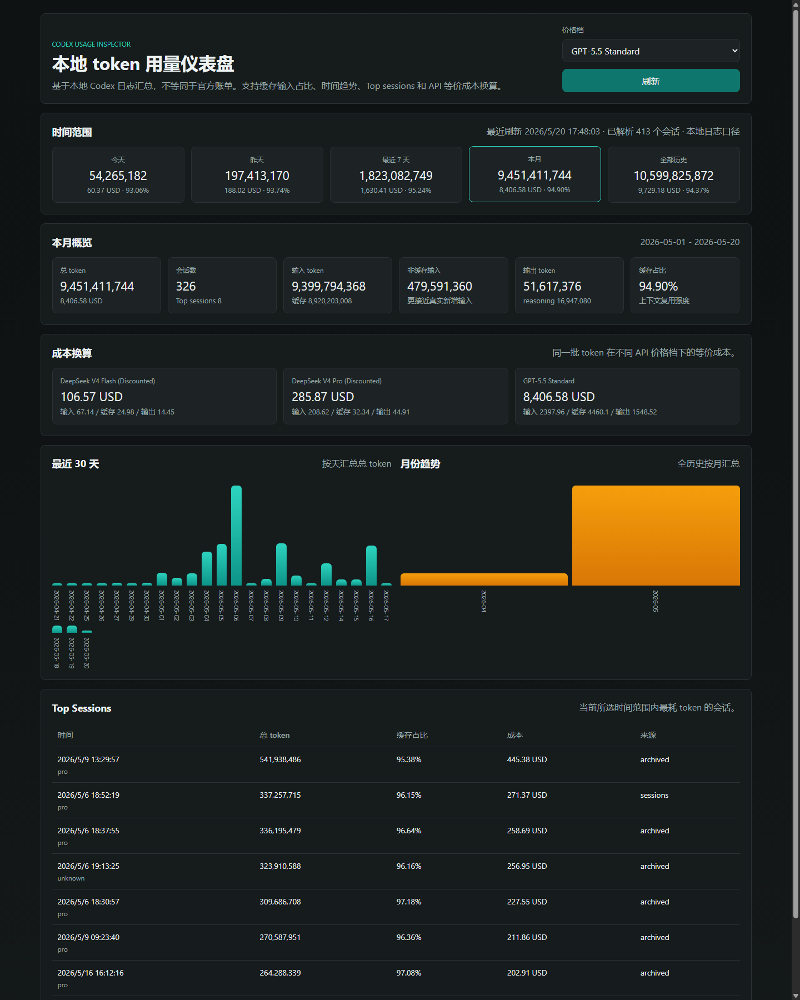

# codex-usage-inspector

一个面向 Codex 本地日志的 token 用量分析插件仓库。当前版本包含：

- Codex 插件骨架
- 可复用的 Python 统计核心
- Codex 内嵌 MCP widget
- 文本报告 CLI
- GPT-5.5 / DeepSeek V4 Pro / DeepSeek V4 Flash 的 API 等价成本换算



## 快速开始

### 作为 Codex 插件使用

插件 MCP server 配置在：

- [plugins/codex-usage-inspector/.mcp.json](plugins/codex-usage-inspector/.mcp.json)

核心入口：

- [plugins/codex-usage-inspector/scripts/mcp_server.py](plugins/codex-usage-inspector/scripts/mcp_server.py)

依赖安装：

```bash
python -m pip install -r "plugins/codex-usage-inspector/requirements.txt"
```

插件内主工具：

- `show_usage_dashboard`
- `get_usage_summary`

### 调试模式

如果你想单独本地调 MCP HTTP 端点：

```bash
python "plugins/codex-usage-inspector/scripts/mcp_server.py" --transport streamable-http --port 8766
```

MCP HTTP 端点：

- `http://127.0.0.1:8766/mcp`

纯文本统计：

```bash
python "plugins/codex-usage-inspector/scripts/token_usage_report.py" --period this-month --json
python "plugins/codex-usage-inspector/scripts/token_usage_report.py" --period last7 --price-profile deepseek-v4-pro-discounted --json
```

## 目录结构

```text
.
├─ .agents/plugins/marketplace.json
├─ plugins/codex-usage-inspector/
│  ├─ .codex-plugin/plugin.json
│  ├─ .mcp.json
│  ├─ requirements.txt
│  ├─ skills/codex-usage-inspector/SKILL.md
│  ├─ scripts/
│  │  ├─ usage_core.py
│  │  ├─ mcp_server.py
│  │  ├─ token_usage_report.py
│  │  └─ serve_dashboard.py
│  ├─ assets/
│  │  ├─ usage-widget.html
│  │  └─ dashboard-preview.png
│  └─ web/
│     ├─ index.html
│     ├─ app.css
│     └─ app.js
└─ LICENSE
```

## 数据口径

- 只读取本地 Codex 日志：`sessions/` 和 `archived_sessions/`
- 同一会话去重后只保留最终有效 token 快照
- `reasoning_output_tokens` 视为 `output_tokens` 的子集，不重复计费
- 这是本地日志口径，不等于 OpenAI 或 DeepSeek 官方账单

## 运行说明

- `show_usage_dashboard` 会在 Codex 里直接渲染 widget，不需要再跳去浏览器网站
- 首次扫描大量本地日志可能需要几十秒
- MCP server 带 300 秒内存缓存，后续刷新通常会快很多

## 定价来源

- OpenAI GPT-5.5 标准价：[OpenAI API Pricing](https://openai.com/api/pricing/)
- DeepSeek V4 Pro / Flash 折扣价：[DeepSeek Models & Pricing](https://api-docs.deepseek.com/quick_start/pricing/)

后续如果官方改价，需要同步更新 `plugins/codex-usage-inspector/scripts/usage_core.py` 里的 `PRICING_PROFILES`。

## Privacy

这个插件的第一版只读取本机日志文件，不联网读取账单，不上传日志内容。价格换算只是基于本地聚合结果做的静态估算。
